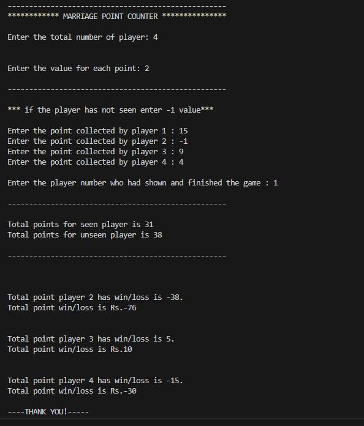

# Marriage(A Nepali Card Game)

Marriage is a matching card game played with three decks of cards in Nepal. It is based on making sets of three matching cards of the same rank (trials), the same rank and suit (tunnels), or three consecutive cards of the same suit (sequences).

For more information on how to play. Please visit [wikipedia](https://en.wikipedia.org/wiki/Marriage_(card_game)#:~:text=The%20overall%20objective%20of%20the,is%20to%20end%20the%20game.)

## Motivation

The main motive behind making this project is that new player find it difficult to calculate how many point they have win or loss. So, this project help the new comers to calculate how much they have win or loss during each round.

## Demo

## Getting Started

Compile and run the mainp.c file

